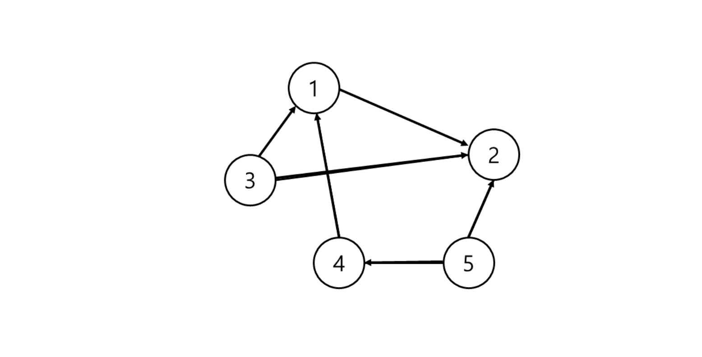
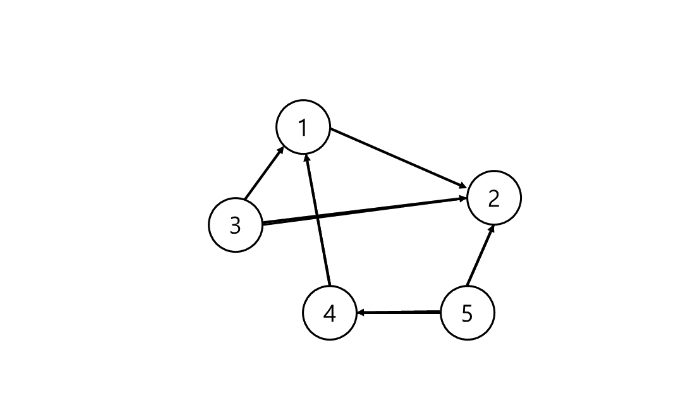
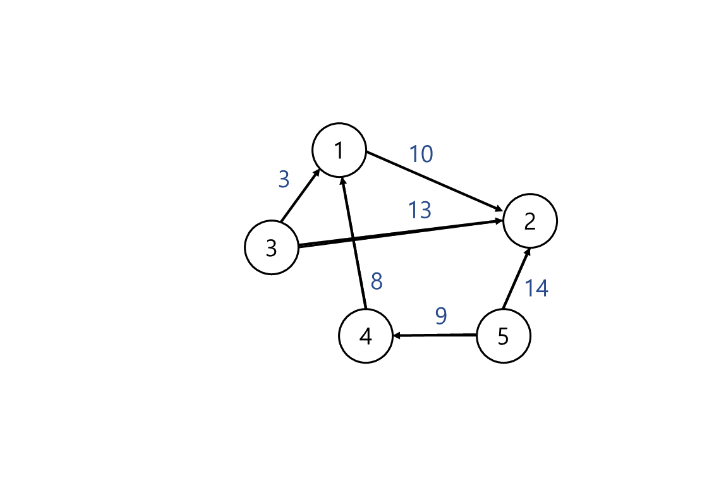

### 그래프(Graph)

-----

###그래프란 ?

그래프는 정점(Vertex)과 그 사이를 잇는 간선(Edge)로 이루어진다.  
` G = (V, E)` 는 정점의 집합 `V`와 간선의 집합 `E`라고 할때, 그래프 `G`는 `V`와 `E`의 집합 `(V, E)`라는 뜻이다.
`V(G)`는 그래프 G의 집합이고, `E(G)`는 그래프 `G`의 간선 집합이다. 

예시)  
`V(G) = {1, 2, 3, 4, 5}`  
`E(G) = {(1,2), (3,1), (3,2), (4,1), (5,2), (5,4)}`



----


### 그래프 용어


- 정점 : 노드(node), 데이터 저장
- 간선 : 정점을 연결하는 선
- 분지수(차수, degree) : 무방향 그래프에서 하나의 정점에 붙어있는 간선 개수
- 내향 분지수 : 방향 그래프에서 들어오는 간선의 수
- 외향 분지수 : 방향 그래프에서 나가는 간선의 수
- 인접
  - 인접(adjacent) : 정점 사이 간선이 있음
  - 부속(incident) : 정점과 간선 사이 관계
- 경로 : 출발지에서 목적지로 가는 순서
- 단순 경로 : 경로 중 반복되는 정점이 없음, 한붓 그리기 처럼 같은 간선 지나지 않음
- 사이클 : 단순 경로의 출발지와 목적지가 같은 경우

### 그래프 종류

#### 무방향 그래프(Undirected Graph)

간선에 방향이 없는 그래프이다. 정점 v와 정점 w를 연결하는 간선을 (v,w)라고 하면 (v,w)와 (w,v)는 같은 간선이다.  
정점이 n개일때 무방향 그래프가 가질 수 있는 최대 간선 수는 `n(n-1)/2` 개이다.


#### 방향 그래프(Directed Graph)

간선에 방향이 있는 그래프이다. 정점 v에서 w로 가는 간선을 (v,w)한다.  
정점 n개일때 방향 그래프가 가질 수 잇는 최대 간선 수는` n(n-1)` 개이다.



#### 완전 그래프(Complete graph)
모든 정점에 간선이 있고, 한 정점에서 다른 정점과 모두 연결되어 있다.


#### 가중치 그래프(Weighted graph)
간선에 가중치(=비용)가 있다.



----

### 그래프 구현 With Java

#### 그래프는 인접행렬 또는 인접 리스트로 표현할 수 있다.

#### 1. 인접 행렬 방식으로 구현하기


`2차원 배열 matrix 사용`  
`matrix[v][w] = 1` : 정점 v에서 정점 w로 가는 간선이 있음
`matrix[v][w] = 0` : 정점 v에서 정점 w로 가는 간선이 없음
ex) 정점5 는 정점 2와 정점 4와 연결되어 있음 즉 matrix[5][2] = 1, matrix[5][4] = 1이고 나머지는 0

인접행렬의 장점
- 연결된 정점 찾기 빠름
- 구현 쉬움
인접행렬의 단점
- `O(n^2)`의 공간 복잡도를 가짐

#### 구현코드
```
public static void main(String[] args){
    int[][] edges = new int[][] {
        {1, 2}, {1, 3}, {1, 4}, {2, 3}, {2, 5}, {4, 5}
    };
    
    int n = 5; //정점의 개수
    
    int[][] matrix = new int[n+1][n+1];
    
    for(int[] edge : edges){
        matrix[edge[0]][edge[1]] = 1;
        matrix[edge[1]][edge[0]] = 1;
    }
    
    //출력
    for(int i = 1 ; i <= n ; i++) {
		for(int j = 1 ; j <= n ; j++) {
			System.out.print(matrix[i][j]+" ");
		}
	    System.out.println();
	}
}
```
```
출력 결과
0 1 1 1 0 0 
1 0 1 0 1 0 
1 1 0 0 0 0 
1 0 0 0 1 0 
0 1 0 1 0 0 
```
-----

#### 2. 인접 리스트방식으로 구현하기


`배열 또는 리스트 사용`
`정점의 개수만큼 헤드 노드가 있고, 각 정점에 인접한 정점들 리스트로 연결`
`정점 v의 인접 정점이 w와z 라면 헤드노드 v에 w와z가 연결리스트로 연결되어 있음`
`예시) 정점5 는 정점2와 정점4와 연결되어 있음, 5번 인덱스에 2와 4가 리스트로 연결`

인접 리스트 장점
- 필요한 만큼 공간 사용하기 때문에 공간 낭비가 적음  

인접 리스트 단점
- 인접행렬보다 구현이 어려움


#### 구현 코드 

```
	public static void main(String[] args) {
		int[][] edges = new int[][] {
			{1, 2}, {1, 3}, {1, 4}, {2, 3}, {2, 5}, {4, 5}
		};
		
		int n = 5;
		
		ArrayList<ArrayList<Integer>> list = new ArrayList<>();
		
		for(int i = 0 ; i <= n ; i++) list.add(new ArrayList<>());
		
		for(int[] edge : edges) {
			list.get(edge[0]).add(edge[1]);
			list.get(edge[1]).add(edge[0]);
		}
		
        //출력
		for (int i = 1; i < list.size(); i++) {
			for(int j = 0 ; j < list.get(i).size(); j++) 
				System.out.print(list.get(i).get(j)+" ");
			System.out.println();
		}
	}
```
```
출력 결과
2 3 4 
1 3 5 
1 2 
1 5 
2 4 
```

